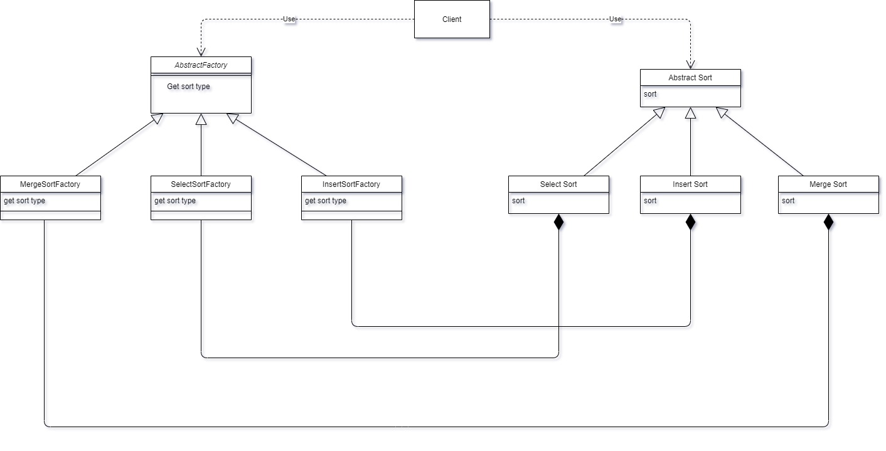

# Abstract Sort Factory Implementation

## Sorts
* `merge`
* `select`
* `insert`

## Usage
`pip install -r requirements.txt`

``
 python3 main.py --f1=file1.txt --f2=file2.txt --sort=merge
``

OR

``
python main.py --f1=file1.txt --f2=file2.txt --sort=merge
``

##Tests
`pytest`

# Class Diagramm

